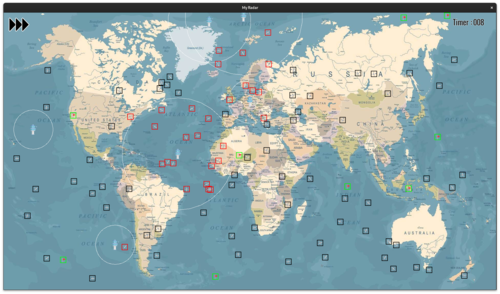

# My Radar

A 2D visualization panel showing a simulatation of air traffic (AT).

A first semester Epitech project

## Table of Contents

- [Introduction](#introduction)
- [Features](#features)
  - [Interface](#interface)
- [Getting Started](#getting-started)
  - [Prerequisites](#prerequisites)
  - [Installation](#installation)
- [Usage](#usage)

## Introduction

Welcome to the My_radar Project! This project aims to create an air traffic simulation using the CSFML library.

<p align="center">
  
  
</p>

## Features

List the main features or functionalities of your project.

- **Simulation of air traffic:**

  The main Feature, simulate an imaginary air traffic. And handle all the collision
- **Generation fo maps**

  A generator that create air traffic for the simulator
- **Stats about the traffic**

  Some stat like the percentage of collision are computed in order to see if it was a great simulation

### Interface

**Planes**
- Red hitbox:    Aircraft protected by the nearest control tower
- Black hitbox:  Vulnearable aircraft
- Green hitbox:  Plane that landed successfully

**Tower**
- White circle:  The radius of protection of the tower

**Collision**
- Basic collision:  If two vulnerable aircraft collide, they both explode
- Protected:        If one of the two aircraft is protected no one explode
- Take of:          A vulnerable aircraft can explode if at his position another aircraft take of.

## Getting Started

### Prerequisites

Before starting you need:

- To make sure you have [CSFML](https://www.sfml-dev.org/download/csfml/) installed.

### Installation

Step-by-step instructions on how to install and configure your project.

1. Clone the repository:
   ```bash
   git clone https://github.com/your-username/your-project.git
2. Install CSFML if not installed:

   **For Debian/Ubuntu-based systems:**
   ```bash
   sudo apt-get install libcsfml-dev
   ```

   **For Red Hat/Fedora-based systems:**
   ```bash
   sudo dnf install csfml-devel
   ```

   **For macOS using Homebrew:**
   ```bash
   brew install csfml
   ```
## Usage

1. **Build the project:**

    Compile the project using a Makefile:

    ```bash
    make
    ```

2. **Generate Map if needed**

   Generate some map if you want to or dont have any to try

   ```bash
   ./bonus/map_generator [nb_aircraft] [nb_tower]
   ```

   The map are created in a folder called tyest_files

   **Options:**

   - nb_aircraft:  The number of aircraft you want to generate

   - nb_tower:     The number of control tower you want to generate

2. **Run the simulation:**

    Execute the generated executable:

    ```bash
    ./my_radar [filepath]
    ```

    **Options:**
   
    - filepath:    The path to a ".radar" map create by the generator

4. **Controls:**

    - Press 'Space' to start and end the simulation when it end running.
    - Use Up and down arrow keys to speed up or slow down the simulation.
    - Use L to display or hide the hitbnox
    - Use S to display or hid the Sprite

5. **Example:**

    Run the simulation with a file with 1000 aircraft and 5 tower that we generated:

    ```bash
    ./my_radar test_files/file_1000_5.radar
    ```
